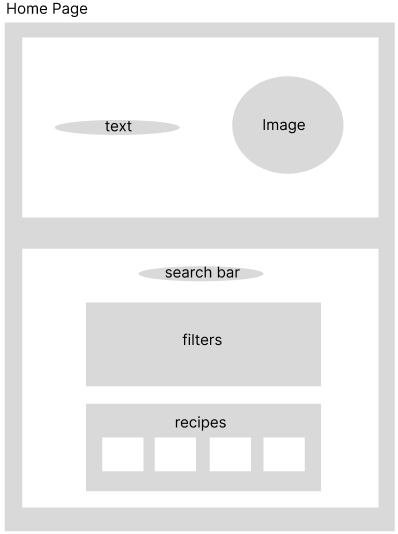
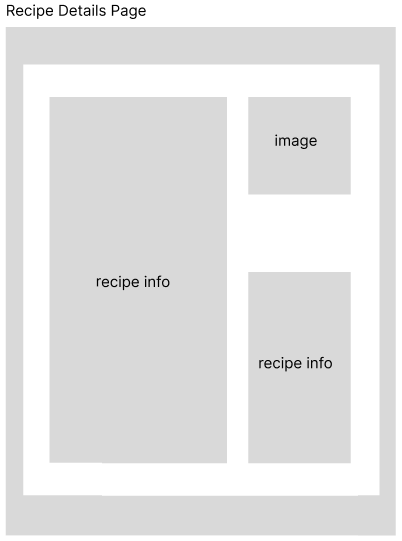

# Project Title

Taste Match

## Overview

Taste Match is an app that helps explore a variety of recipes tailored to different eating preferences and available ingredients. With the help of filters such as cuisine type, meal type, dish type, allergies, and diets users can receive recipe recommendations according to their choices.

## Instructions to run the project

- Clone Express back-end from https://github.com/tetiana-batura/taste-match-backend
- Open cloned Express project and run: npm install. This way all libraries will get ready for the project to run.
- Start Express backend with: npm run dev. By configuration, the server will be running on http://localhost:8080
- Clone React front-end from https://github.com/tetiana-batura/taste-match
- Open cloned React app and run: npm install. This way all libraries will get ready for the project to run.
- Start React app with: npm run dev. By default, the app will be running on http://localhost:5173


### Problem Space

It can be challenging to meet certain diet parameters or health standards when trying to create the right recipe. This is solved by Taste Match that allows to input the ingredients and preferences you have to obtain recommended recipes. This is time-conscious and helps consume whatever ingredient users already have.

### User Profile

The main users of Taste Match are:

- Health-oriented users: People with specific dietary goals searching for recipes that match their health goals.
- Users with dietary restrictions: Users with allergies or intolerances needing safe recipe selections
- Users Short on Time: People who want to use ingredients they already have.

App ensures that users can easily navigate filters without feeling tedious and offers options for filtering.

### Features

- Ingredient-based search: Enabled user to enter ingredients they have on hand, app will return results of recipes that included those items.
- Cuisine, meal, and dish type filters: Users can refine their search based on cuisine, meal type, or dish type.
- Allergies and Diet filters: Users can enter allergies to avoid some ingredients.
- Recipe detail view: Displays ingredients, links to cooking instructions, nutrition information, cuisine type, meal type, dish type, allergies, and diets.

## Implementation

### Tech Stack

- React
- Express
- Client libraries:
  - React
  - react-dom
  - react-router-dom
  - axios
  - sass
- Server libraries:
  - axios
  - express
  - cors
  - dotenv

### APIs

- Edamam Recipe Search API that provides access to recipe data and allows to filter by particular preferences.
- Internal API which becomes a proxy server.

### Sitemap

- Home Page with Search Results functionality:
  - Search bar to enter ingredients.
  - Sorting options by filters (cuisine type, meal type, dish type, allergies, diets).
  - List of filtered recipes with images, number of ingredients and calorie count.
- Recipe Detail Page:
  - Ingredients, links to cooking instructions, nutrition information, cuisine type, meal type, dish type, allergies, and diets.

### Mockups

#### Home Page



#### Recipe Detail Page



### Data

- Recipes: Each recipe includes ID, title, image, source and its url, cuisine type, meal type, dish type, allergies, diets, calories, nutrients, ingredients, instructions.

Data relationships:

- Recipes can belong to multiple categories (e.g., cuisine type, meal type, diet).

### Endpoints

#### External API endpoints:

**GET api/recipes/v2 to get default recipes** (handled by express)

Parameters:

- q: avocado
- app_id: <app_id needed to make API calls to API>
- app_key: <app_key needed to make API calls to API>
- type: public

**POST api/recipes/v2 to get a custom list of recipes** (handled by express)

- q: <search query>
- app_id: <app_id needed to make API calls to API>
- app_key: <app_key needed to make API calls to API>
- diet: <to filter by diet>
- health: <to filter by alergies>
- cuisineType: <type of cuisine of the recipe>
- mealType: <type of meal a recipe belongs to>
- dishType: <the dish type a recipe belongs to>
- type: public

**GET api/recipes/v2/:id**

Parameters:

- id: <to retrieve a specific recipe>
- app_id: <app_id needed to make API calls to API>
- app_key: <app_key needed to make API calls to API>
- type: public

#### Internal API endpoints:

The endpoints below are the endpoints of the internal API (express proxy server) which will be exposed to the React frontend. These endpoints will use the same parameters used for the external API call mentioned in the “External API endpoints” section.

**GET /recipes** for default list of recipes

**POST /recipes** for a custom list of recipes

**GET /recipes/:id** for a selected recipe

Below is the example of fetching all the recipes, but it got shortened for the sake of being used as an example. A single recipe is fetched by id and it holds the same data as it would be fetched included in a bulk recipe retrieval; therefore, refer the below example for fetching a single recipe excluding any other data beyond a single recipe within the hits array of recipes.

Shortened response: 

```
{
…
"\_links": {
"next": {
"href": "https://api.edamam.com/api/recipes/v2?q=chicken&app_key=52637ea6&_cont=CHcVQ&health=kosher&cuisineType=mexican&type=public&app_id=c0ef17f1",
"title": "Next page"
}
},
"hits": [
{
"recipe": {
"uri": "http://www.edamam.com/ontologies/edamam.owl#recipe_3781ee8f13fa4c93bb4abd7d06803ce5",
"label": "Easy Chicken Posole",
"images": {
"THUMBNAIL": {
"url": "url here"
…
},
…
"source": "Martha Stewart",
"url": "https://www.marthastewart.com/1524911/easy-chicken-posole",
…
"dietLabels": [],
"healthLabels": [
"Sugar-Conscious",
…
],
"cautions": [
"Gluten", ],
"ingredientLines": [
"1 quart Basic Chicken Stock or store-bought low-sodium chicken broth",
…
],
"ingredients": [
{
"text": "1 quart Basic Chicken Stock or store-bought low-sodium chicken broth",
…
}
],
"calories": 726.2593153314131,
…
"cuisineType": [
"mexican"
],
"mealType": [
"lunch/dinner"
],
"dishType": [
"main course"
],
"totalNutrients": {
"ENERC_KCAL": {
"label": "Energy",
"quantity": 726.2593153314131,
…
},
…
]
},
"\_links": {
"self": {
"title": "Self",
"href": "https://api.edamam.com/api/recipes/v2/3781ee8f13fa4c93bb4abd7d06803ce5?type=public&app_id=c0ef17f1&app_key=52637ea62e11fd12d3f3ddf726c73a3a"
}
}
},
{other recipes},
{other recipes},
{other recipes},
]}

```

## Roadmap

Core Frontend Functionality:

- Setup Frontend: Initialize the React project and install required libraries in order to begin the project.
- Setup Backend: Initialize the Express project and install required libraries.
- Define internal API routes and serve dummy data.
- Home Page & Ingredient Search: Create the Home Page with the search bar. Fetch internal API routes to get the dummy data.
- Replace the dummy data within Express server with real API calls to Edamam API.
- On the frontend ensure that the data coming from the Express server is being processed as expected.
- Filters: Add filter options for cuisine type, meal type, dish type, allergies, diet preferences. Confirm that these filters are functional.
- Recipe Detail Page: On the frontend develop a recipe detail page where users can view the recipe ingredients, links to instructions, nutrition facts and connected to the Express server. On the Backend update the Express routes to handle calls for a single recipe to the Edamam API.

Testing:

- Error handling: Manage API calls efficiently and provide for error handling cases like invalid input and no result for searches.
- Testing, Bug Fixes & UI Refinements: Perform testing and fix bugs to ensure functionality and responsiveness across devices.
- Final Check: Improve the overall look of the UI and make all final tweaks to enable the users to have a delightful experience.

Final Steps:

- Presentation Prep: Prepare a working demo for the presentation.

---

## Future Implementations

If MVP is completed the following features will be implemented:

- Additional features on the home page such as featured recipes or recipes by cuisine type.
